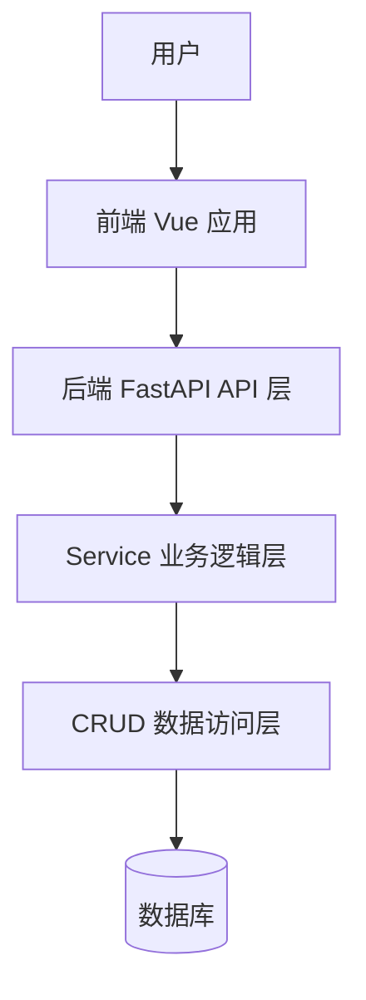

# ARCHITECTURE.md

## 已由 AI 根据当前项目状态初始化

> 本文档用于帮助 AI 和开发者快速理解项目架构、目录结构、接口约定和功能模块。
> 
> 本文档由 AI 协助维护。每次新增、修改、删除功能后，应同步更新本文档。

---

## 1. 项目说明

由 AI 维护。

建议包含：

- 项目名称
- 项目目标
- 主要使用场景
- 当前开发阶段
- 核心功能范围

---

## 2. 技术栈说明

由 AI 维护。

### 2.1 后端技术栈

由 AI 维护。

示例：

- Python
- FastAPI
- SQLAlchemy / Tortoise ORM
- PostgreSQL / MySQL
- Alembic
- JWT

### 2.2 前端技术栈

由 AI 维护。

示例：

- Vue 3
- Vite
- Vue Router
- Pinia
- Element Plus
- Axios

### 2.3 部署与运行环境

由 AI 维护。

示例：

- Docker
- Docker Compose
- Nginx
- Linux
- PostgreSQL

---

## 3. 总体架构图

由 AI 维护，使用 Mermaid 绘制。



---

## 4. 架构维护规则

### 4.1 AI 维护规则

AI 修改代码后，必须根据实际变更同步维护本文档。

需要同步维护的内容包括：

* 项目说明
* 技术栈说明
* 总体架构图
* 后端实际目录结构
* 前端实际目录结构
* 接口调用链路
* 数据模型约定
* 功能模块清单
* 本文件变更记录

### 4.2 禁止修改规则

原则上禁止 AI 主动修改以下内容：

* 结构约定
* 接口基础规则
* 统一响应格式
* 数据模型命名原则
* 已确认的分层架构

如确实需要修改，AI 必须先说明原因、影响范围和替代方案，等待确认后再修改。

---

## 5. 结构约定

原则上禁止 AI 修改本章节内容。

项目采用前后端分离结构。

### 5.1 后端结构约定

后端原则上采用 `api / service / crud` 三层结构。

* `api`：负责接口定义、请求参数接收、响应返回
* `service`：负责业务逻辑、流程编排、权限判断、参数校验
* `crud`：负责数据库操作，不编写业务逻辑

推荐补充结构：

* `schemas`：负责请求和响应数据结构定义
* `models`：负责数据库模型定义
* `core`：负责核心配置、安全认证、异常处理等
* `utils`：负责通用工具函数

### 5.2 前端结构约定

前端原则上采用以下结构：

* `api`：封装后端请求
* `router`：管理路由
* `layouts`：页面整体布局
* `views`：页面级组件
* `components`：通用 UI 组件
* `composables`：通用组合式逻辑
* `utils`：通用工具函数
* `stores`：状态管理
* `constants`：常量定义

---

## 6. 接口约定

原则上禁止 AI 修改本章节内容。

### 6.1 基础规则

* 后端接口统一以 `/api` 开头
* 接口路径使用小写字母和中划线
* 请求和响应统一使用 JSON
* 时间字段统一使用 ISO 8601 格式
* 列表接口统一支持分页
* 接口返回结构保持一致
* 新增接口必须补充到接口调用链路中

### 6.2 统一响应格式

```json
{
  "code": 0,
  "msg": "success",
  "data": {}
}
```

### 6.3 分页响应格式

```json
{
  "code": 0,
  "msg": "success",
  "data": {
    "items": [],
    "total": 0,
    "page": 1,
    "page_size": 10
  }
}
```

### 6.4 错误响应格式

```json
{
  "code": 400,
  "msg": "error message",
  "data": null
}
```

---

## 7. 后端实际目录结构

由 AI 维护。

### 7.1 目录结构

```text
backend/
由 AI 根据实际项目维护
```

### 7.2 文件说明

| 目录 | 文件 | 功能 | 最后一次修改日期 |
| ---- | ---- | ---- | ---------------- |
|      |      |      |                  |

---

## 8. 前端实际目录结构

由 AI 维护。

### 8.1 目录结构

```text
frontend/
由 AI 根据实际项目维护
```

### 8.2 文件说明

| 目录 | 文件 | 文件功能 | 最后一次修改日期 |
| ---- | ---- | -------- | ---------------- |
|      |      |          |                  |

---

## 9. 接口调用链路

由 AI 维护。

用于描述前端页面、前端 API、后端 API、Service、CRUD、数据库之间的调用关系。

| 功能模块 | 前端页面 | 前端 API | 后端接口 | Service | CRUD | 数据表 |
| -------- | -------- | -------- | -------- | ------- | ---- | ------ |
|          |          |          |          |         |      |        |

示例：

| 功能模块 | 前端页面                  | 前端 API      | 后端接口         | Service                   | CRUD                  | 数据表     |
| -------- | ------------------------- | ------------- | ---------------- | ------------------------- | --------------------- | ---------- |
| 用户列表 | `views/user/UserList.vue` | `api/user.ts` | `GET /api/users` | `user_service.list_users` | `user_crud.get_users` | `sys_user` |

---

## 10. 数据模型约定

由 AI 维护。

### 10.1 数据库模型

| 模型 | 数据表 | 功能 | 关联关系 |
| ---- | ------ | ---- | -------- |
|      |        |      |          |

### 10.2 Pydantic Schema

| Schema | 类型     | 功能 | 使用位置 |
| ------ | -------- | ---- | -------- |
|        | 请求模型 |      |          |
|        | 响应模型 |      |          |

### 10.3 字段命名约定

原则上禁止 AI 修改本章节内容。

* 数据库字段使用小写字母和下划线
* Python 变量使用小写字母和下划线
* 前端变量使用 camelCase
* 接口 JSON 字段原则上与后端 Schema 保持一致
* 时间字段统一使用 `created_at`、`updated_at`
* 主键字段统一使用 `id`

---

## 11. 功能模块清单

由 AI 维护。

| 模块 | 功能 | 前端位置 | 后端位置 | 当前状态                 |
| ---- | ---- | -------- | -------- | ------------------------ |
|      |      |          |          | 未开始 / 开发中 / 已完成 |

示例：

| 模块     | 功能         | 前端位置     | 后端位置      | 当前状态 |
| -------- | ------------ | ------------ | ------------- | -------- |
| 用户管理 | 用户增删改查 | `views/user` | `api/user.py` | 开发中   |

---

## 12. 页面清单

由 AI 维护。

| 页面名称 | 路由路径 | 文件位置 | 功能说明 | 关联接口 |
| -------- | -------- | -------- | -------- | -------- |
|          |          |          |          |          |

---

## 13. 接口清单

由 AI 维护。

| 方法 | 路径 | 功能 | 请求参数 | 响应数据 | 对应 Service |
| ---- | ---- | ---- | -------- | -------- | ------------ |
|      |      |      |          |          |              |

---

## 14. 配置说明

由 AI 维护。

| 配置项 | 作用 | 默认值 | 使用位置 |
| ------ | ---- | ------ | -------- |
|        |      |        |          |

---

## 15. 部署说明

由 AI 维护。

用于记录当前项目的运行方式和部署结构。

### 15.1 本地开发

由 AI 维护。

### 15.2 生产部署

由 AI 维护。

### 15.3 Docker / Compose 说明

由 AI 维护。

---

## 16. AI 编码注意事项

AI 在编码时必须遵守：

* 修改代码前先阅读本文档
* 新增功能前先确认功能属于哪个模块
* 新增接口后必须更新接口清单和调用链路
* 新增页面后必须更新页面清单
* 新增数据表后必须更新数据模型约定
* 不允许绕过 `api / service / crud` 分层
* 不允许在 `api` 层直接写数据库操作
* 不允许在 `crud` 层写业务逻辑
* 不允许无理由大规模重构目录结构
* 不允许为了“更完整”主动扩展当前需求范围

---

## 17. 本文件变更记录

由 AI 维护。

| 日期 | 变更内容 | 修改人 |
| ---- | -------- | ------ |
|      |          | AI     |
