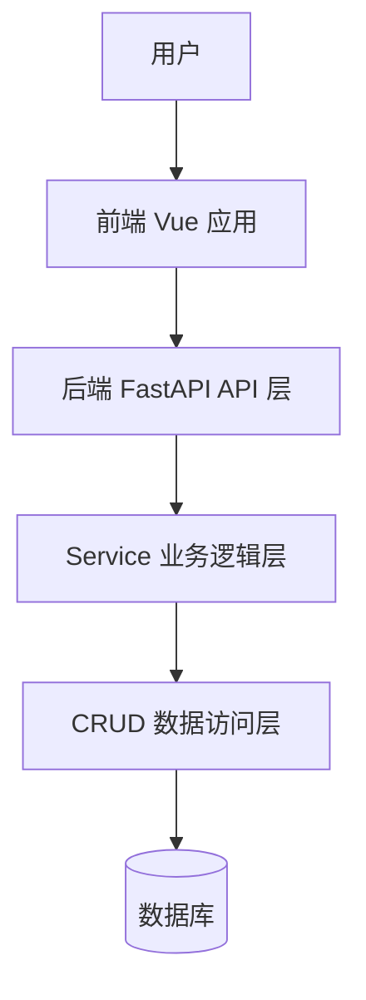

# ARCHITECTURE.md

> 本文档用于帮助 AI 和开发者快速理解项目架构、目录结构和功能模块。
> 
> 本文档由 AI 协助维护。每次新增、修改、删除功能后，应同步更新本文档。

---

## 1. 项目说明

由 AI 维护。

建议包含：

- 项目名称
- 项目目标
- 主要使用场景
- 当前开发阶段
- 核心功能范围

---

## 2. 技术栈说明

由 AI 维护。

### 2.1 后端技术栈


### 2.2 前端技术栈


### 2.3 部署与运行环境

由 AI 维护。


---

## 3. 总体架构图

由 AI 维护，使用 Mermaid 绘制。



---


## 5. 后端实际目录结构

由 AI 维护。

### 5.1 目录结构

```text
backend/
由 AI 根据实际项目维护
```

### 5.2 文件说明

| 目录 | 文件 | 功能 | 最后一次修改日期 |
| ---- | ---- | ---- | ---------------- |
|      |      |      |                  |

---

## 6. 前端实际目录结构

由 AI 维护。

### 6.1 目录结构

```text
frontend/
由 AI 根据实际项目维护
```

### 6.2 文件说明

| 目录 | 文件 | 文件功能 | 最后一次修改日期 |
| ---- | ---- | -------- | ---------------- |
|      |      |          |                  |

---

## 7. 接口调用链路

由 AI 维护。

用于描述前端页面、前端 API、后端 API、Service、CRUD、数据库之间的调用关系。

| 功能模块 | 前端页面 | 前端 API | 后端接口 | Service | CRUD | 数据表 |
| -------- | -------- | -------- | -------- | ------- | ---- | ------ |
|          |          |          |          |         |      |        |

示例：

| 功能模块 | 前端页面                  | 前端 API      | 后端接口         | Service                   | CRUD                  | 数据表     |
| -------- | ------------------------- | ------------- | ---------------- | ------------------------- | --------------------- | ---------- |
| 用户列表 | `views/user/UserList.vue` | `api/user.ts` | `GET /api/users` | `user_service.list_users` | `user_crud.get_users` | `sys_user` |

---

## 8. 数据模型清单

由 AI 维护。

### 8.1 数据库模型

| 模型 | 数据表 | 功能 | 关联关系 |
| ---- | ------ | ---- | -------- |
|      |        |      |          |

### 8.2 Pydantic Schema

| Schema | 类型     | 功能 | 使用位置 |
| ------ | -------- | ---- | -------- |
|        | 请求模型 |      |          |
|        | 响应模型 |      |          |


---

## 9. 功能模块清单

由 AI 维护。

| 模块 | 功能 | 前端位置 | 后端位置 | 当前状态                 |
| ---- | ---- | -------- | -------- | ------------------------ |
|      |      |          |          | 未开始 / 开发中 / 已完成 |

示例：

| 模块     | 功能         | 前端位置     | 后端位置      | 当前状态 |
| -------- | ------------ | ------------ | ------------- | -------- |
| 用户管理 | 用户增删改查 | `views/user` | `api/user.py` | 开发中   |

---

## 10. 页面清单

由 AI 维护。

| 页面名称 | 路由路径 | 文件位置 | 功能说明 | 关联接口 |
| -------- | -------- | -------- | -------- | -------- |
|          |          |          |          |          |

---

## 11. 接口清单

由 AI 维护。

| 方法 | 路径 | 功能 | 请求参数 | 响应数据 | 对应 Service |
| ---- | ---- | ---- | -------- | -------- | ------------ |
|      |      |      |          |          |              |

---

## 12. 配置说明

由 AI 维护。

| 配置项 | 作用 | 默认值 | 使用位置 |
| ------ | ---- | ------ | -------- |
|        |      |        |          |

---

## 13. 部署说明

由 AI 维护。

用于记录当前项目的运行方式和部署结构。

### 13.1 本地开发

由 AI 维护。

### 13.2 生产部署

由 AI 维护。

### 13.3 Docker / Compose 说明

由 AI 维护。

---

